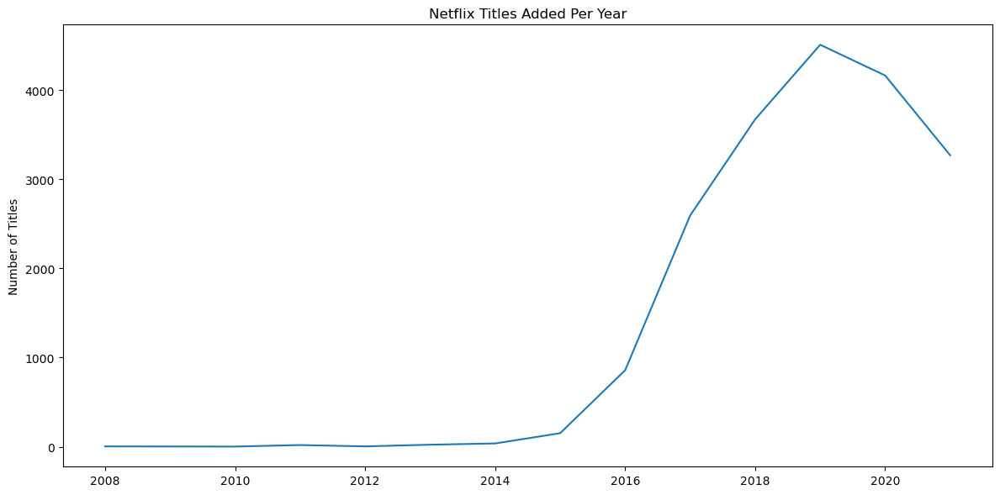
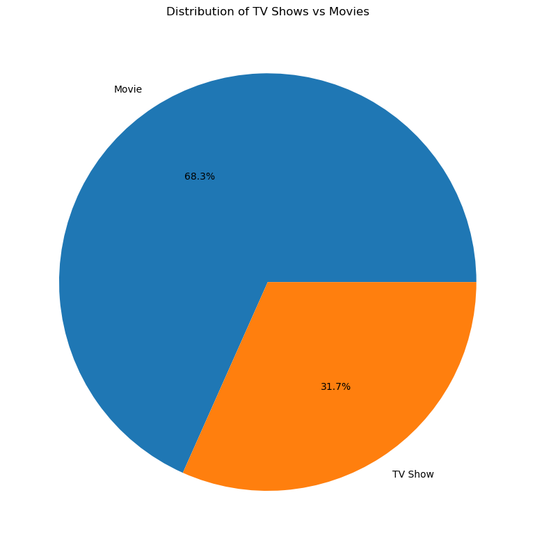
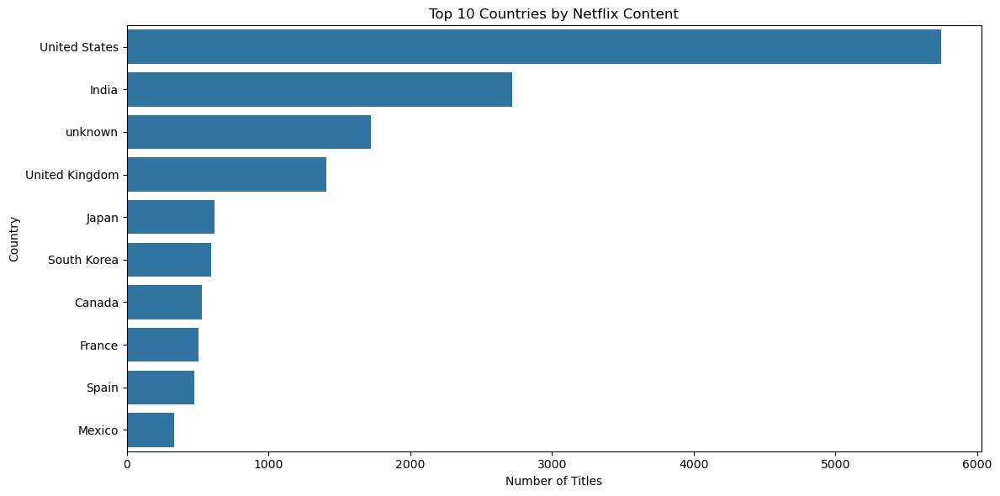

# 📺 Netflix Titles Data Analysis

**A hands-on data analysis project using Python to clean, explore, and visualize Netflix's content catalog.**

---

## ✍️ Author

**Tanuj Kumai** — Aspiring Data Analyst  
🔗 [GitHub](https://github.com/yourusername) | 🔗 [LinkedIn](https://linkedin.com/in/yourprofile)  
🧠 Continuously building my data skills through self-driven projects like this one.

---

## 📚 Dataset Info

| Attribute | Detail |
|-----------|--------|
| **Name** | Netflix Movies and TV Shows |
| **Source** | [Kaggle - Shivam Bansal](https://www.kaggle.com/datasets/shivamb/netflix-shows) |
| **Size** | 6,756 titles |
| **Time Frame** | 2008–2021 |
| **Features** | title, type, country, release_year, rating, duration, date_added |

---

## 🔍 Project Objectives

- ✅ Clean and preprocess messy real-world data
- ✅ Parse date columns and handle missing values
- ✅ Analyze trends in content type, release years, and geography
- ✅ Create clear visualizations with proper labels and formatting
- ✅ Document insights and make the project reproducible

---

## 🛠 Tools & Libraries Used

| Category           | Tools                              |
|--------------------|-------------------------------------|
| **Programming**    | Python 3.11                         |
| **IDE & Workflow** | VS Code, Jupyter Notebooks          |
| **Data Wrangling** | pandas, numpy                       |
| **Visualization**  | matplotlib, seaborn                 |
| **Environment**    | Conda (via `environment.yml`)       |
| **Version Control**| Git & GitHub                        |

---

## 📊 Key Findings

### 1. 📈 Content Growth Over Time



- Netflix saw rapid content growth peaking in **2019**
- Sharp drop in new content after 2020 likely due to the pandemic

---

### 2. 🎞️ Type of Content



| Type     | Percentage |
|----------|------------|
| Movies   | 68.3%      |
| TV Shows | 31.7%      |

- Movies dominate Netflix's library by nearly **2:1**

---

### 3. 🌍 Top Production Countries



- **USA** leads by a large margin (41.9%), followed by:
  - 🇮🇳 **India** (14.4%)
  - 🇬🇧 **UK** (6.2%)

---

## 🧠 Lessons Learned

### ✅ Real-World Data Cleaning
- Parsed string dates like `"July 15, 2016"` to datetime objects
- Dealt with missing values and inconsistent formats

### 📊 Visualization Skills
- Created bar plots, histograms, and line charts
- Learned how to adjust axes, legends, and layout for clarity

### 🔍 Insight Extraction
- Learned to ask meaningful questions of the data
- Developed habit of documenting steps and explaining results

---

## 🚀 How to Reproduce

```bash
# Step 1: Clone the repository
git clone https://github.com/yourusername/netflix-data-analysis.git
cd netflix-data-analysis

# Step 2: Set up the environment
conda env create -f env/environment.yml
conda activate netflix_env

# Step 3: Launch the notebook
jupyter notebook notebooks/netflix_analysis.ipynb
